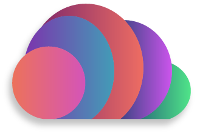
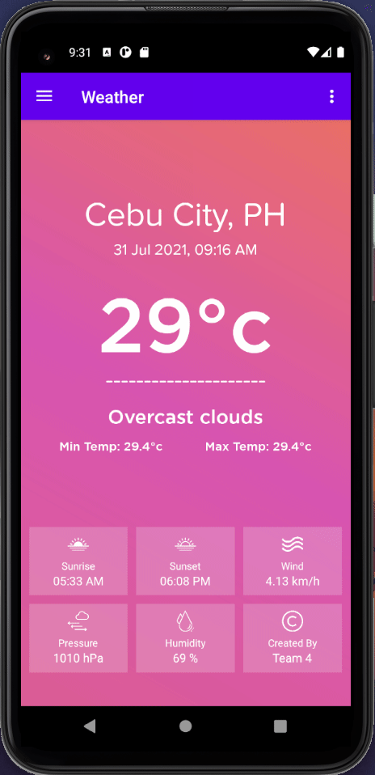
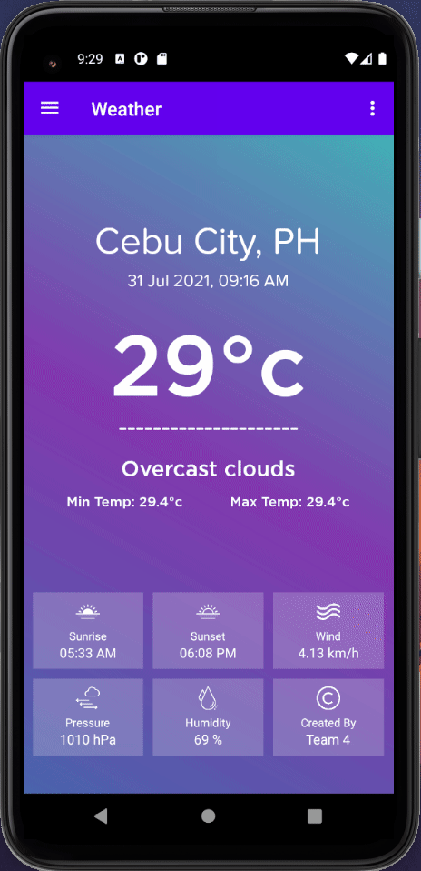
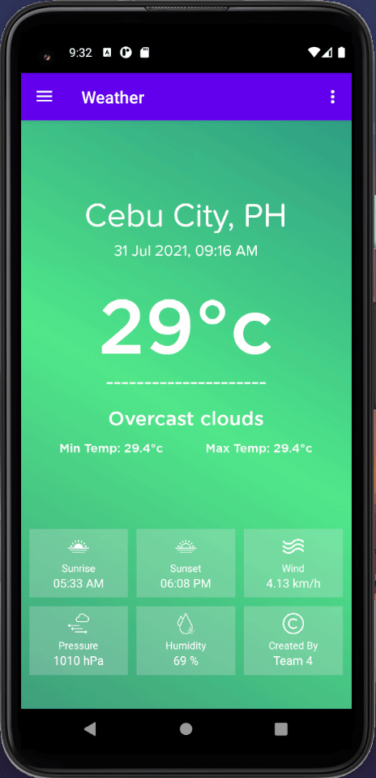

#  ColorCloud 

  
   
  

 

ColorCloud is a beautiful and simple Android Weather application utlizing the [OpenWeather](https://openweathermap.org/) API to provide users with relevant weather data.

## TODO
- [ ] UI
    - [X] WeatherFragment
    - [X] PasswordFragment
    - [X] ThemeFragment
    - [ ] Navigation Drawer
    - [ ] Login Activity (Color)
    - [ ] Login Password AlertDialog (Color)
- [ ] Services
    - [ ] OpenWeather API call
    - [ ] User data persistence
        - [X] Username
        - [X] Password
        - [ ] Color
- [ ] Documentation
- [ ] Refactoring and code cleaning
